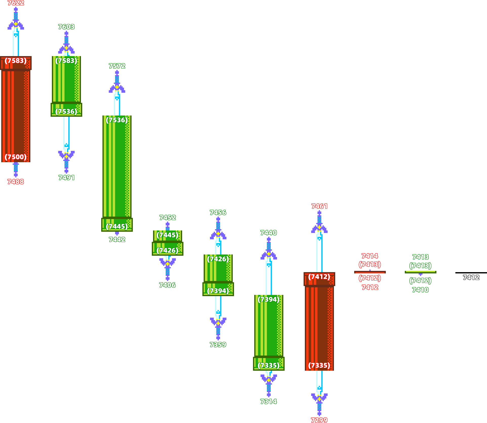

# SMM2 - Candlestick Chart Generator

[](https://github.com/AceSuperBest/smm2-candlestick/actions/workflows/build.yaml)

English: [README_EN](README_EN.md) (Incomplete)

以下是主分支的wiki，只有更新大板时才会更新，变动频繁的wiki导引被我放在了[Wiki](https://github.com/AceSuperBest/smm2-candlestick/wiki/Wiki%E2%80%90Home)了，优先以Wiki为准。

# 导引
创建一个可以基于分数生成K线图表的脚本

**灵感来源于白胖水友社区**

*目前无完整的英文翻译，因为感觉不会有什么人看*

本项目并不算完善的，还需要做很多事情，而且机制很可能后面会改不少，所以，有需求在issue提吧

**当前已经具备自动打包的Release、生成K线、生成K线数字、组合图、纵坐标（分数轴）、横坐标（日期时间轴）、Windows提示，以及加了i18n的提示多语种支持（原生的错误全部为英文）**

# 如何启动？
## 安装
### 直接 Python 启动

最起码安装一个 3.10 的 Python: [Python](https://www.python.org/downloads/)

本项目开发在 3.12.1 版本，由于 3.12 之后支持更高级的 f-string 格式，如果我不经意间使用了就得换了，所以建议使用更新的版本。

由于项目是必然有 3.10 才支持的 Union 类型注解的`|`格式，因此如果不用 3.10 以上无法运行

*如果需要虚拟环境的话需要提前创建并激活*

```shell
pip install pillow pydantic
```

或

```shell
pip install -r requirements.txt
```

### 使用 Release 打包版

下载 SMM2-Candlestick.zip -> 解压到合适目录

## 给出 kline.csv 数据
目前timestamp并没有被使用，只需要保证逻辑上是顺序即可，程序会自动对csv数据的timestamp字段做升序排序

kline.csv:

```csv
timestamp,open,high,low,close
1717862400,7500,7622,7488,7583
1717948800,7583,7603,7491,7536
1718035200,7536,7572,7442,7445
1718121600,7445,7452,7406,7426
1718208000,7426,7456,7359,7394
1718294400,7394,7440,7314,7335
1718380800,7335,7461,7299,7412
1718467200,7412,7414,7412,7413
1718553600,7413,7413,7410,7412
1718640000,7412,7412,7412,7412
```

这个文件可以在 candlestick.json 配置中自定义 name 字段确定

## 生成
在本目录所在路径执行(确保assets文件夹数据存在, kline.csv存在)

当前版本在Windows下执行会检测是否有kline.csv，如果没有的话会启用一个文件选择器

```shell
python app.py
```

或

直接执行app.exe，需要保证assets文件夹在该exe所在目录

## 结果
会在脚本所在目录或app.exe所在目录生成一个kline.png、kline-number.png、kline-merged.png

而这个 kline 也是对应 candlestick.json 的 name

kline.png:


kline-merged.png




# 图像属性
## 高度 / height
满足公式: `height = (candlestick.scale * (max(data.score) - min(data.score) + 1))`

简单说，记 assets 里面的 candlestick 配置的`scale`，那么每`scale`个像素对应一分

即如果给定的所有数据中，最高分是 $7800$，最低分 $7700$ 。那么图片的`height`就应该有 $101\text{scale}$，表示 $\left[7700,7800\right]$ 的闭区间

## 宽度 / width
这里的每个图像的宽也满足`scale`，`scale`乘上素材的宽度是每个素材可能的占用，一般的，会取所有素材的宽的最大值

而间隔`spacing`需要修改 assets 的 coordinate.json 配置

当前的`spacing`也会根据`scale`来放大，后面视情况独立。

## 顶部 / top
图片的最高位($y=0$)，被视为所有给定数据的最高分，本质所有的K线柱都是通过最高分来确定位置的。

带数字的图片的($y=0$)无法用于对齐，需要找到最高处的剑或者水管亦或者横盘线的像素，因此推荐使用分离的图片自行外部合并。

所以有利用需求可以通过**最高分位置**并且以**scale像分比例**去做如匹配坐标系等的应用

## 关于素材 / About assets
素材其实是可以替换的，请根据 assets 里面的图片与同名的 json 配置文件作为参考，其中 candlestick.json 有着素材本身的名字配置。

对于数字图以及未来可能的坐标轴来说，coordinate.json 是主要的配置定义

*更加细致的细节请参考`graphics/*`与`asset/*`的代码*

素材的组成部分是将素材文件**从上到下**计算长度（一般而言就是分数值）

- `static`会强制渲染出来，但为了维持像素与分数的对应关系，一般不会用，也不建议
- `region`表示素材文件的按量渲染部分（也就是不会重复的部分），比如大师剑渲染出被拔出多少的这样的效果
- `duplication`表示素材文件的依照给定长度堆叠渲染的部分，只要维持延伸纹理即可（非要不连贯也不是不可以）

在配置中的每个`static`、`region`、`duplication`数组都不能填入多个，只能填入一个数组，本来的打算是支持多部分，但是代码相对比较复杂，现在是简化版

而每个数组以四元组`(x, y, width, height)`的方式表示，这种格式在这里被称为 Coord Box。

该四元组支持整型和字符串表示：

- 整型`int`: 表示像素大小
- 字符串数字: 将转为整型
- `%`: 百分比将转换为素材文件的宽高比例（x对应`width`，y对应`height`）
- `px`: 与纯数值一致
- `center`: 表示素材对应的中位（`width // 2`，`height // 2`）
- `min`: 恒为 $0$
- `max`: 对应宽高的 `100%`

**Example**

```json
{
    "region": [
        [0, 0, "100%", 24]
    ],
    "duplication": [
        [0, 24, "100%", 1]
    ]
}
```

表示对于长度在 $24$ 以内的，按长度选用`region`的图像，而长度大于 $24$ 的，则超过部分等量地堆叠`duplication`
